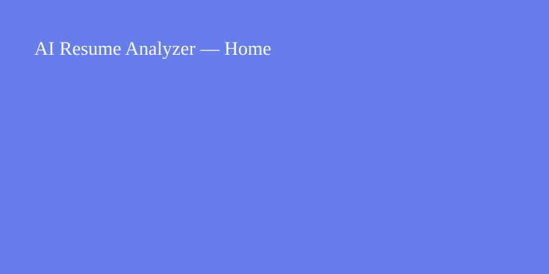
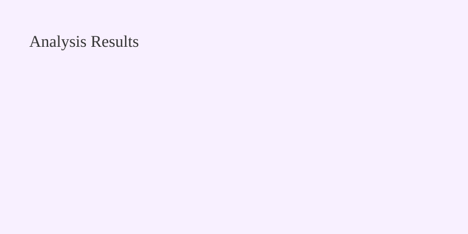

# AI Resume Analyzer

AI-powered Resume Analyzer with ATS scoring, job matching, skill extraction, and optional Gemini/OpenAI feedback.

---

## Quick Overview

- Transparent ATS scoring (skills, keywords, experience, education, formatting)
- Resume ↔ Job description matching and similarity scoring
- Skill extraction and gap analysis
- LLM-powered resume review, rewrites, and interview questions (optional)
- PDF report generation for recruiter-friendly sharing
- Web UI built with Flask and Chart.js for dashboards

---

## Project Structure

Top-level layout (see files in repo):

```
AI_Resume_Analyzer/
├── app.py              # Flask application entry point
├── requirements.txt    # Python dependencies
├── data/               # Demo data, resumes, job descriptions
├── models/             # ATS scoring, matching, recommender, LLM adapters
├── utils/              # Parser, preprocessing, report generator
├── templates/          # HTML templates
├── static/             # CSS, JS, images
└── screenshots/        # Example screenshots for README
```

---

## Installation (local)

1. Create and activate a Python virtual environment:

```powershell
python -m venv venv
venv\Scripts\activate
```

2. Install dependencies:

```powershell
pip install -r requirements.txt
```

3. Run the app:

```powershell
python run.py
```

Open http://127.0.0.1:5000 in your browser.

Copy `.env.example` to `.env` and set `SECRET_KEY` before production.

---

## Usage

1. Upload a resume (PDF/DOCX/TXT) and paste a job description on the home page.
2. Optionally enable AI analysis for LLM-powered feedback.
3. View the ATS breakdown, matched/missing skills, recommendations, and download a PDF report.

API endpoints (selected):

- `POST /api/analyze` — analyze resume + job description (form-data)
- `GET /api/samples` — load demo resume + job description
- `POST /api/report` — generate PDF report from analysis JSON

---

## Screenshots

Home, Upload and Results screenshots are included under `screenshots/` (placeholders).





---

## Tech stack

- Python 3.10+
- Flask
- scikit-learn, NLTK, pandas
- ReportLab (PDF generation)
- Chart.js for client-side charts
- Optional: Google Gemini / OpenAI for LLM features

---

## Development notes

- Use `python TEST_SUITE.py` to run the project's built-in checks.
- The app's health endpoint is available at `/health`.

---

## Future improvements

- Add Firebase Authentication and user history
- Polish UI and replace screenshot placeholders with real captures
- Add CI/CD (GitHub Actions) and unit tests

---

## Contributing

Contributions welcome — open an issue or a pull request.

---

## License

MIT